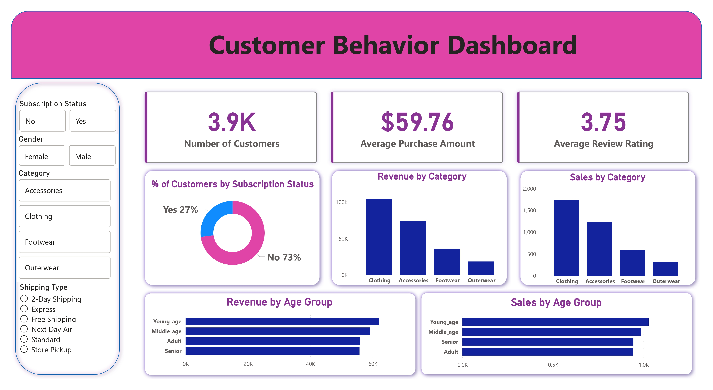

# Customer Shopping Behavior Analysis

## 📌 Project Overview

This project analyzes customer shopping behavior using transactional data from **3,900 purchases** across multiple product categories.
The objective is to uncover insights into **spending patterns, customer segmentation, product performance, and subscription behavior** to support data-driven business decisions.


## 📊 Key Metrics

* **Total Customers:** 3,900
* **Features:** 18
* **Average Purchase Amount:** $59.76
* **Average Review Rating:** 3.75


## 🛠️ Tools & Technologies

* **Python** (Pandas, NumPy) – Data cleaning & preprocessing
* **MySQL** – Data analysis using SQL queries
* **Power BI** – Interactive dashboard & visualization


## 📂 Project Structure

```
customer-shopping-behavior-analysis/
├── customer_shopping_data.csv
├── customer_behavior_analysis.ipynb
├── customer_behavior_analysis_queries.sql
├── powerbi_dashboard.jpg
├── customer_behavior_analysis_presentation.pdf
├── customer_behavior_analysis_report.pdf
└── README.md
```


## 🔍 Key Insights

* **Revenue Distribution:**
  Male customers generate significantly higher revenue compared to female customers.

* **Customer Segmentation:**

  * Loyal: 3,116 (79.9%)
  * Returning: 701 (17.97%)
  * New: 83 (2.13%)

* **Subscription Behavior:**

  * 27% customers are subscribers
  * 73% are non-subscribers
  * Repeat buyers are mostly non-subscribers → conversion opportunity

* **Product Insights:**
  Top-rated products include Gloves, Sandals, and Boots.

* **Shipping Impact:**
  Express shipping customers spend more on average than standard shipping users.


## 📈 Dashboard Preview




## 🧠 Business Recommendations

* **Increase Subscriptions:**
  Target repeat buyers with exclusive subscription benefits.

* **Customer Retention:**
  Implement loyalty programs to convert returning customers into loyal customers.

* **Optimize Discounts:**
  Balance discount strategies to improve profitability.

* **Targeted Marketing:**
  Focus on high-revenue age groups and premium shipping users.

* **Product Strategy:**
  Promote top-rated and best-selling products in campaigns.


## 🚀 How to Use

1. Open the Jupyter Notebook:
   ```
   customer_behavior_analysis.ipynb
   ```
2. Run data preprocessing and analysis steps
3. Execute SQL queries in MySQL using:

   ```
   customer_behavior_analysis_queries.sql
   ```
4. View the Power BI dashboard for insights


## 📌 Dataset

The dataset contains customer transactions including demographics, purchase behavior, and review ratings.
It is used for educational and analytical purposes.


## 👤 Author

**Zahid Ernical**


## ⭐ Conclusion

This project demonstrates an end-to-end data analytics workflow — from **data cleaning and SQL analysis to visualization and business insights**, making it a strong portfolio project for data analyst roles.
